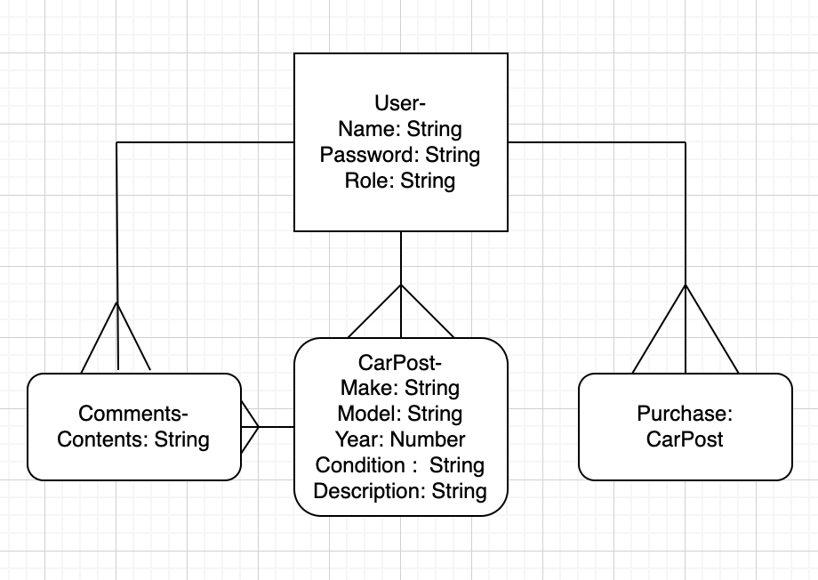

# CarBid Api

An api to serve data for a carbid site

## Prompt

E-Commerce Store

## Tech

Express

## Installation

## Structure

## API

### Authentication

| Verb   | URI Pattern          | Controller#Action         |
| ------ | -------------------- | ------------------------- |
| POST   | `/sign-up`           | `users#signup`            |
| POST   | `/sign-in`           | `users#signin`            |
| PATCH  | `/change-password/`  | `users#changepw`          |
| DELETE | `/sign-out/`         | `users#signout`           |
| POST   | `/listing`           | `users#createlisting`     |
| PATCH  | `/listing/:id`       | `users#editlisting`       |
| DELETE | `/listing/:id`       | `users#deleteslist`       |
| GET    | `/cars`              | `GetListings`             |
| PATCH  | `/cars/:id`          | `show#cars`               |
| POST   | `/cars/:id/comments` | `users#addcommentstocars` |
| DELETE | `/cars/:id/comments` | `users#deletescomments`   |
| PATCH  | `/cars/:id`          | `users#updatescurrentbid` |

## About

This api updates everything a user does on the front end from logging in to purchasing vehicles or creating post.

## ERD

## Wireframe

## API
